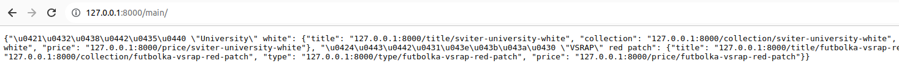
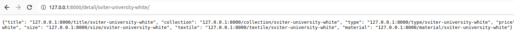
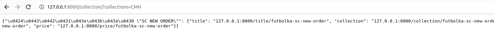
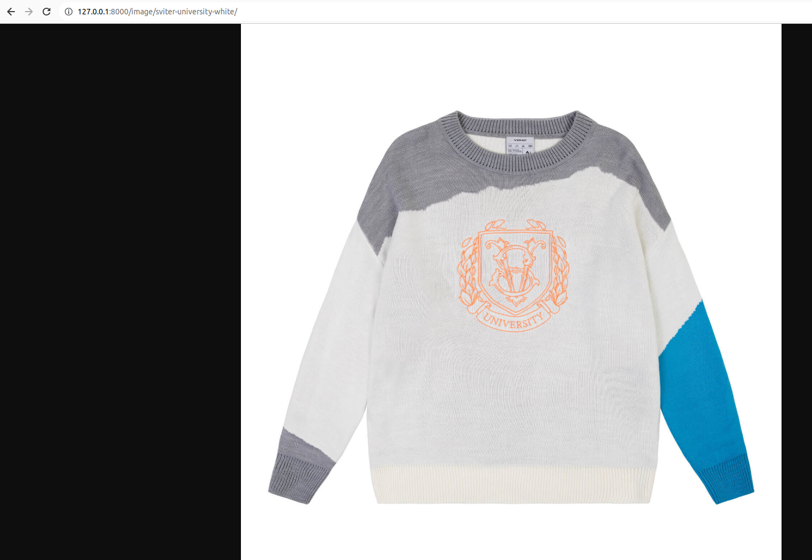

## Как запустить docker

После скачивания репозитория зайди в корневую папку проекта. Открой её через терминал,
и напиши команду: docker-compose up -d

## ENDPOINT
 ip/main/ - json содержащий список товара

ip/detail/slug/ - json содержащий всю информацию о товаре

ip/collection/?collections= - json список товара из коллекции, которая будет указа в get-запросе

ip/field/slug/ - поле товара определенного товара

field - любое поле товара(image, price, title, size, textile, material, collection, type)

slug - сформированный индекс для каждого товара по его названию

